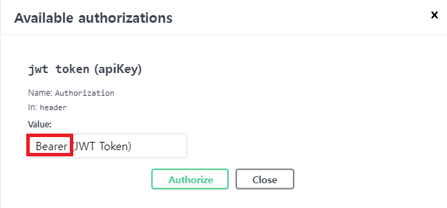

# 스푼 라디오 과제 전형


## How to run

```shell
$ unzip sp-assignment-main.zip
$ cd sp-assignment-main/spoon
$ ./gradlew clean build
$ java -jar build/libs/spoon-0.0.1-SNAPSHOT.jar
```

## 검증 방법
- [Swagger](http://localhost:8080/docs/swagger)를 통해 API를 테스트할 수 있습니다.

### Swagger 테스트 방법
- [회원 가입](http://localhost:8080/docs/swagger-ui/index.html#/User%20Api/signUp) 진행
- 회원가입 완료 후 [로그인](http://localhost:8080/docs/swagger-ui/index.html#/Auth%20Api/signIn) 진행
- 로그인 완료 시 응답되는 `token`을 `Authorize` 버튼을 통해 입력
  - 토큰 앞에 prefix로 `Bearer `를 입력해야합니다.(띄어쓰기 포함)
      - 


## Skills
- Java 11
- Spring Boot 2.7.14
- Spring Data JPA
- H2 Database
- Swagger
- rest-assured
- jwt
- guava


### 패키지 구조

```java
├─java
│  └─com
│      └─assignment
│          └─spoon
│              │  SpoonApplication.java
│              │
│              ├─application
│              │  ├─auth
│              │  │  │  AuthService.java
│              │  │  │  CustomUserDetailService.java
│              │  │  │
│              │  │  ├─exception
│              │  │  │      AuthorizationException.java
│              │  │  │      JwtAccessDeniedHandler.java
│              │  │  │      JwtAuthenticationEntryPoint.java
│              │  │  │
│              │  │  └─filter
│              │  │          JwtTokenExtractor.java
│              │  │          JwtTokenFilter.java
│              │  │          JwtTokenProvider.java
│              │  │
│              │  ├─liveroom
│              │  │      LiveRoomService.java
│              │  │
│              │  └─user
│              │          UserService.java
│              │
│              ├─common
│              │  ├─exceptions
│              │  │      CommonExceptionHandler.java
│              │  │
│              │  └─utils
│              │          PasswordEncoderFactory.java
│              │
│              ├─config
│              │      JpaAuditingConfiguration.java
│              │      JwtSecurityConfiguration.java
│              │      SwaggerConfiguration.java
│              │      WebSecurityConfiguration.java
│              │
│              ├─domain
│              │  │  BaseEntity.java
│              │  │
│              │  ├─auth
│              │  │      LoginUser.java
│              │  │      LoginUserAdapter.java
│              │  │
│              │  ├─liveroom
│              │  │      LiveRoomStore.java
│              │  │
│              │  └─user
│              │      │  User.java
│              │      │  UserCommand.java
│              │      │  UserDto.java
│              │      │  UserInfo.java
│              │      │  UserReader.java
│              │      │  UserStore.java
│              │      │
│              │      ├─block
│              │      │      BlockHistory.java
│              │      │      BlockUserPk.java
│              │      │
│              │      └─fan
│              │              Fan.java
│              │
│              ├─infrastructure
│              │  ├─liveroom
│              │  │      LiveRoomStoreImpl.java
│              │  │
│              │  └─user
│              │      │  UserReaderImpl.java
│              │      │  UserRepository.java
│              │      │  UserStoreImpl.java
│              │      │
│              │      ├─block
│              │      │      BlockHistoryRepository.java
│              │      │
│              │      └─fan
│              │              FanRepository.java
│              │
│              └─presentation
│                  ├─auth
│                  │      AuthController.java
│                  │      AuthRequest.java
│                  │      AuthResponse.java
│                  │
│                  ├─liveroom
│                  │      LiveRoomController.java
│                  │      LiveRoomRequest.java
│                  │
│                  └─user
│                          UserController.java
│                          UserRequest.java
│                          UserResponse.java
│
└─resources
        application.yml

```

### 테이블 스키마

```sql
CREATE TABLE users (
    id BIGINT PRIMARY KEY AUTO_INCREMENT, # 유저 고유 아이디
    email VARCHAR(255) NOT NULL, # 유저 이메일
    password VARCHAR(255) NOT NULL, # 유저 패스워드
    status VARCHAR(50) NOT NULL, # 유저 상태 (DJ, LISTENER)
    created_at TIMESTAMP NOT NULL, # 생성일
    updated_at TIMESTAMP # 수정일
);

CREATE TABLE fans (
    id BIGINT PRIMARY KEY AUTO_INCREMENT, # 팬 고유 아이디
    dj_id BIGINT NOT NULL, # DJ 유저 고유 아이디
    follower_id BIGINT NOT NULL, # 팔로워 유저 고유 아이디
    created_at TIMESTAMP NOT NULL, # 생성일 
    updated_at TIMESTAMP, # 수정일
    FOREIGN KEY (dj_id) REFERENCES users (id),
    FOREIGN KEY (follower_id) REFERENCES users (id)
);

CREATE TABLE block_histories (
    user_id BIGINT NOT NULL, # 유저 고유 아이디
    block_user_id BIGINT NOT NULL, # 차단 유저 고유 아이디
    created_at TIMESTAMP,  # 생성일
    updated_at TIMESTAMP,  # 수정일
    PRIMARY KEY (user_id, block_user_id),
    FOREIGN KEY (user_id) REFERENCES base_entities (id),
    FOREIGN KEY (block_user_id) REFERENCES base_entities (id)
);
```

## API Docs
- [Swagger](http://localhost:8080/docs/swagger)
